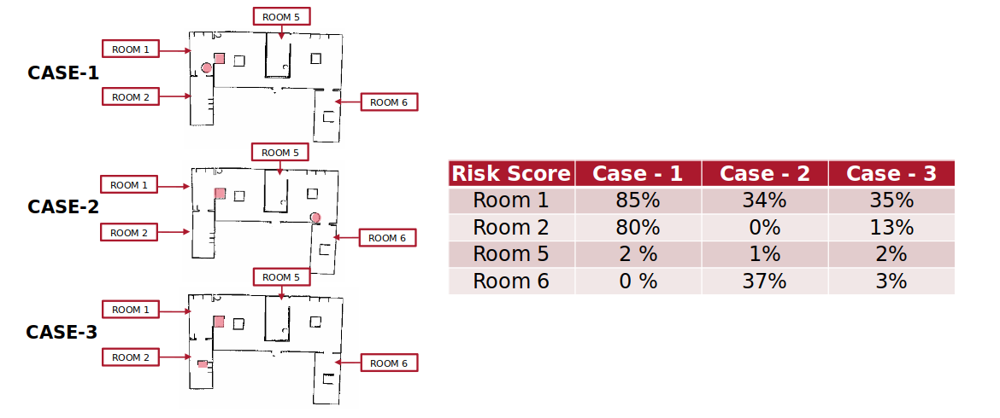
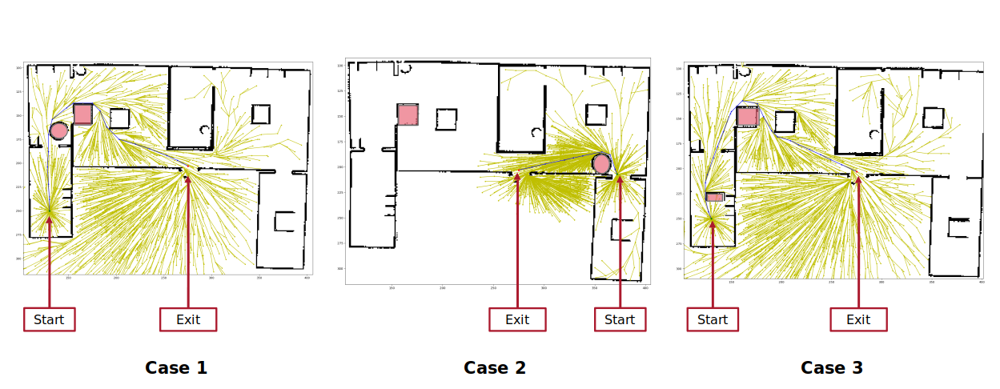
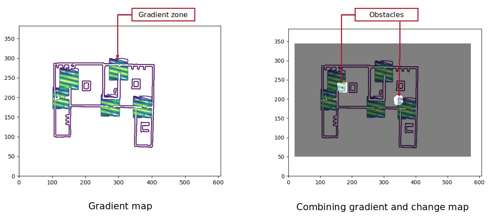
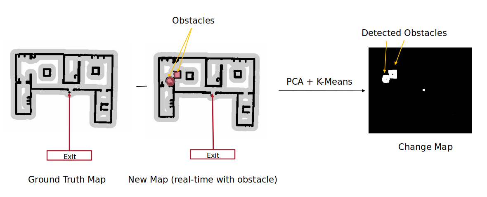

# Scalable Mobile Robot System for Real-time Fire Safety Evaluation

## Abstract 
In a study on home structural fires by the National Fire Protection Association, by categorizing the death and injury by activity when injured, it is observed that those who were fatally injured were most likely to have been trying to escape, resulting in around 38% of the deaths. This includes navigating through obstacles and getting out of entrapment. While the main cause of death is usually smoke inhalation, exit blockage is a very dangerous underlying condition that often leads to excessive smoke inhalation. In another survey it is found that out of all the firegrounds fatalities of firefighters, one-and two-family houses constitute the maximum fatality of 39 percent, making homes– the place people feel safest from fire, also where they are at significant risk. Thus, the team has made its goal to make homes slightly safer by developing an indoor autonomous mobile robot that moves around freely and detects obstacles blocking the exit, if any. Furthermore, the robot would notify the user about the obstacle and give out a score on how dangerous that obstacle could be in case of an emergency. The robot was able to successfully detect obstacles in the closest path to the exit and give out suitable risk scores, in a simulation of house floorplans. 


### Requirements
The code was tested with Ubuntu 20.04, ROS Noetic.
Before you start, make sure that you have Turtlebot packages installed by following steps mentioned at [Robotis](https://emanual.robotis.com/docs/en/platform/turtlebot3/overview/) website.


### Step-by-Step Procedure

1. Put the [src](src) folder in your own workspace.
2. Map the environment by using following commands:
```
export TURTLEBOT3_MODEL=burger
roslaunch <package_name> navigation.launch
```
3. Once map is created, save the map by running this command on a new terminal:
```
rosrun map_server map_saver -f obs_costmap map:=<apth_to_workspace>/src/statemachine
/robot_map
```
4. To evaluate the safety metrics, run the python script:
```
rosrun <package_name> score.py
```

### Results

Mapping the environment for new obstacles using SLAM Gmapping:


Metric scores (Higher the percentage, more risk due to the now obstacel):
          

Change in path length due to different obstacles using RRT*:


Gradient zones at exit points using Gaussaian gradient filter:


New obstacle detection using PCA and K-means:

